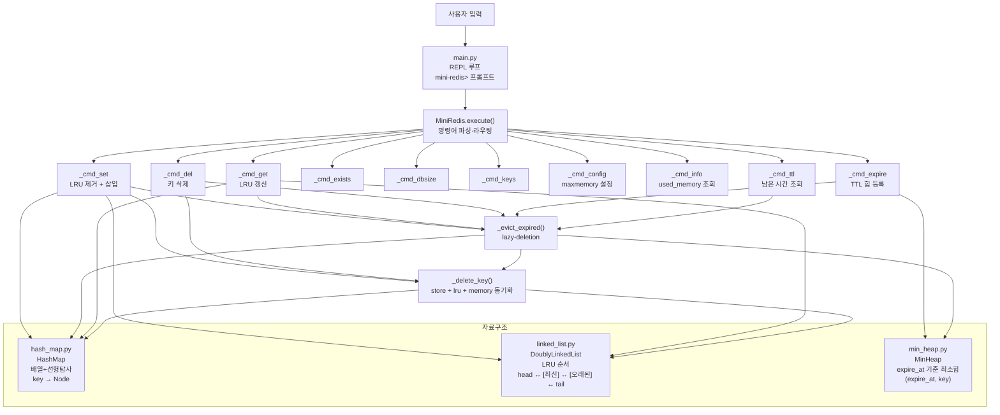

# 구조도

## 모듈 역할 요약

| 파일 | 역할 |
|------|------|
| `main.py` | REPL 루프, `mini-redis> ` 프롬프트 |
| `mini_redis.py` | 명령어 파싱·실행, 세 자료구조 조율 |
| `hash_map.py` | O(1) 키 조회용 배열 기반 해시맵 |
| `linked_list.py` | LRU 순서 유지용 이중 연결 리스트 |
| `min_heap.py` | TTL 만료 순서 관리용 최소힙 |
